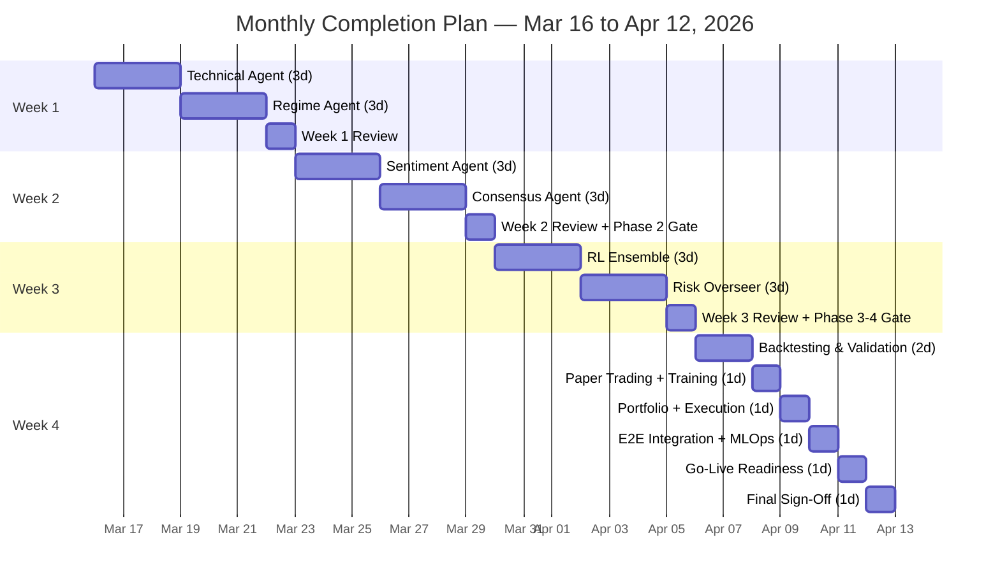

# Multi-Agent AI Trading System — Monthly Completion Plan
**Planning Window**: March 16, 2026 → April 12, 2026 (4 weeks, 28 days)  
**Aligned to**: `Multi_Agent_AI_Trading_System_Plan_Updated.md` v1.3.7  
**Starting Point**: Phase 1 (Data Orchestration) substantially complete through Week 6 + Hypercare

---

## Current Status (as of March 15, 2026)

| Component | Status |
|-----------|--------|
| NSE Sentinel Agent | ✅ Complete (Week 2) |
| Macro Monitor Agent | ✅ Complete (Week 3) |
| Preprocessing Agent | ✅ Complete (Weeks 3–4) |
| Textual Data Agent | ✅ Complete (Weeks 4–5) |
| Week 6 Hardening & Integration | ✅ Mostly complete (Day 7 handoff pending) |
| Phase 2: Analyst Board (Technical, Regime, Sentiment, Consensus) | ❌ Not started |
| Phase 3: Strategic Executive (RL Ensemble) | ❌ Not started |
| Phase 4: Risk Overseer | ❌ Not started |
| Phase 5: Validation & Evolution Loop | ❌ Not started |

---

## Scope for the Next 4 Weeks

### Agents to Build (3 days each = 12 agent-days)

| # | Agent | Section | Days | Core Deliverables |
|---|-------|---------|------|-------------------|
| 1 | **Technical Agent** | §6.1 | 3 | ARIMA-LSTM hybrid, 2D CNN, GARCH VaR/ES models; baselines and ablation |
| 2 | **Regime Agent** | §6.2 | 3 | PEARL/meta-learning; RBI band zones; OOD detection; structural break validation |
| 3 | **Sentiment Agent** | §6.3 | 3 | FinBERT fine-tune on Indian data; dual-speed scoring; cache pipeline; spam/manipulation filters |
| 4 | **Consensus Agent** | §6.4 | 3 | LSTAR/ESTAR Bayesian consensus; crisis-weighted routing; divergence signaling |
| 5 | **RL Ensemble (Strategic Executive)** | §7 | 3 | SAC/PPO/TD3 ensemble; teacher-student distillation; reward library; observation space |
| 6 | **Risk Overseer** | §11 | 3 | Kill-switch hierarchy; volatility-scaled budgets; XAI/SHAP logging; operating modes |

### Cross-Cutting Work (woven into each week)

| Track | Scope |
|-------|-------|
| **Testing & Validation** | Unit tests per agent, integration tests, stress tests, leakage tests |
| **Training Pipelines** | Model training scripts, walk-forward evaluation, backtest (2018–present) |
| **Phase 5 Validation** | Vectorbt backtests, paper-trading harness, stress scenario library |
| **Tier 1 Enhancements** | Real-time slippage monitor, volatility-scaled risk budgets, order-book imbalance, latency discipline |

---

## Week-by-Week Execution Plan

---

### 🗓 Week 1: March 16 – March 22 (Mon → Sun)
**Focus**: Technical Agent + Regime Agent

#### Days 1–3 (Mon–Wed): Technical Agent — §6.1

| Day | Tasks | Tests & Training |
|-----|-------|------------------|
| **Day 1** | • Define observation/feature schema from Gold-tier Phase 1 outputs • Implement ARIMA-LSTM hybrid model skeleton with training harness • Set up model registry entries and data snapshot pipeline • Define target metrics (directional accuracy, RMSE, Sharpe contribution) | • Unit tests for feature ingestion and schema validation • Verify model can consume Phase 1 Gold-tier data without leakage |
| **Day 2** | • Implement 2D CNN model for OHLCV pattern recognition • Implement GARCH quantile model for VaR and ES estimation • Build baseline models (buy-and-hold, simple MA crossover) for comparison • Create training config with walk-forward split dates | • Train all 3 model families on 2019–2023 data • Walk-forward backtest on 2023–2025 holdout • Ablation tests: each model family vs baseline |
| **Day 3** | • Build Technical Agent orchestrator that runs all models and outputs signal payload • Define output schema: predictions, confidence intervals, VaR/ES levels • Checkpoint: verify payload is consumable by downstream Consensus Agent • Document model cards (hyperparams, data requirements, known limitations) | • Integration test: Phase 1 Gold data → Technical Agent → signal payload • Leakage test suite for timestamp alignment and feature lag • Training stability test (`test_retraining.py` pattern) |

#### Days 4–6 (Thu–Sat): Regime Agent — §6.2

| Day | Tasks | Tests & Training |
|-----|-------|------------------|
| **Day 4** | • Define regime taxonomy: RBI inner/outer band, volatility states, trend, crisis • Implement PEARL (or equivalent meta-learning) model skeleton • Define structural break reference set (2008 crisis, 2013 taper tantrum, COVID, RBI policy discontinuities) • Set up regime label generation pipeline from historical data | • Unit tests for regime label generation • Verify structural break dates are correctly tagged in training data |
| **Day 5** | • Train regime model on historical data with structural break validation • Implement transition criteria logic (event-driven shifts, volatility regime changes) • Implement OOD / novelty detection with statistical distance thresholds • Add alien-state flag with staged de-risking logic (full → reduced → neutral/cash) | • Train and validate on 2008, 2013, COVID windows • Calibration tests: regime probabilities sum to 1, transition smoothness • OOD detection: synthetic out-of-distribution inputs trigger alien-state flag |
| **Day 6** | • Build Regime Agent orchestrator with output schema: regime probabilities, transition signals, OOD flags • Integrate with Technical Agent outputs for regime-conditioned signals • Document regime definitions, calibration parameters, and escalation logic | • Integration test: Gold data → Regime Agent → regime payload • Stability test: regime labels consistent across repeated runs • Stress test: impossible scenarios (correlation inversion, frozen prices) |

#### Day 7 (Sun): Week 1 Review & Integration Gate

- Run combined Technical + Regime agent pipeline end-to-end
- Review test results, fix defects, update documentation
- Produce Week 1 checkpoint report with pass/fail evidence
- Prepare input contract for Week 2 (Sentiment + Consensus agents)

---

### 🗓 Week 2: March 23 – March 29 (Mon → Sun)
**Focus**: Sentiment Agent + Consensus Agent

#### Days 1–3 (Mon–Wed): Sentiment Agent — §6.3

| Day | Tasks | Tests & Training |
|-----|-------|------------------|
| **Day 1** | • Set up FinBERT (ProsusAI/finbert) base model with fine-tuning pipeline • Prepare Indian fine-tuning datasets: `harixn/indian_news_sentiment`, SEntFiN • Implement dual-speed architecture: fast lane (lightweight + keyword rules) and slow lane (deep model) • Define sentiment cache schema (Redis-ready): score, timestamp, confidence, TTL | • Unit tests for dataset loading and tokenization • Verify base FinBERT produces valid predictions on sample Indian headlines |
| **Day 2** | • Fine-tune FinBERT on Indian datasets with Bayesian priors / regularization • Implement intraday fast-lane scoring (≤100ms target from headline arrival) • Build cache write pipeline with TTL, freshness, and confidence fields • Implement cache decision policy: fresh → use, stale → downweight, expired → ignore • Add pump-and-dump / slang-scam detection for code-mixed text | • Training: fine-tune on Indian data, evaluate precision/recall by class • Latency benchmark: measure fast-lane end-to-end scoring time • Test cache read/write with TTL expiry scenarios • Manipulation detection: test on known pump-and-dump patterns |
| **Day 3** | • Build Sentiment Agent orchestrator with daily aggregate z_t threshold variable • Implement robustness controls: spam filtering, source dedup, noise handling • Add sentiment-to-price mismatch circuit breaker hooks • Define output schema: sentiment scores, confidence, TTL, manipulation flags • Integrate with Textual Data Agent outputs from Phase 1 | • Integration test: Phase 1 text canonical records → Sentiment Agent → scored output • Dual-loop boundary test: text floods cannot flip portfolio direction alone • Cache read failure test: verify fallback to technical-only reduced-risk mode • Weekly re-fine-tuning validation against SEntFiN |

#### Days 4–6 (Thu–Sat): Consensus Agent — §6.4

| Day | Tasks | Tests & Training |
|-----|-------|------------------|
| **Day 4** | • Implement LSTAR and ESTAR logistic/exponential transition functions • Set up Bayesian estimation of smoothness and location parameters • Define transition function inputs: volatility, macro differentials, RBI signals, sentiment quantiles • Build weighted consensus engine with safety bias toward protective signals | • Unit tests for transition functions (edge cases, parameter ranges) • Bayesian estimation convergence tests on synthetic data |
| **Day 5** | • Implement crisis-weighted routing with capped dominance (max 60–70% for crisis agent) • Model agent divergence as a dedicated regime signal → staged risk reduction • Add snapback measurement tests (recovery ticks after flash-shock) • Build Consensus Agent orchestrator combining all Phase 2 agent outputs | • Training: estimate parameters on historical multi-signal data • Consensus stability test during high-volatility windows (2020 COVID, 2022 Oct–Nov) • Crisis routing test: verify dominance cap is enforced • Agent divergence test: verify risk reduction triggers on disagreement |
| **Day 6** | • Integration of all 4 Phase 2 agents into unified Analyst Board pipeline • Define versioned observation schema for Phase 3 (RL Ensemble) consumption • Phase 2 GO/NO-GO pre-check against §16.1 benchmarks • Document all model cards, parameters, and known limitations | • Full pipeline test: Gold data → Technical → Regime → Sentiment → Consensus → observation payload • Ablation: each agent's contribution to consensus signal quality • Baseline/ablation packs complete for each active model family (§16.1 Phase 2 GO gate) |

#### Day 7 (Sun): Week 2 Review & Phase 2 Gate

- Run full Phase 2 pipeline end-to-end with realistic data
- Phase 2 GO/NO-GO gate evaluation (§16.1)
- Fix critical defects; document open issues for Hypercare
- Produce Week 2 checkpoint report and Phase 3 input contract

---

### 🗓 Week 3: March 30 – April 5 (Mon → Sun)
**Focus**: Strategic Executive (RL Ensemble) + Risk Overseer

#### Days 1–3 (Mon–Wed): Strategic Executive (RL Ensemble) — §7

| Day | Tasks | Tests & Training |
|-----|-------|------------------|
| **Day 1** | • Define observation space from Phase 2 outputs: regime probabilities, VaR/ES, macro differentials, sentiment scores • Implement reward library: RA-DRL composite, Sharpe, Sortino, Calmar, Omega, Kelly variants • Set up SAC, PPO, and TD3 policy skeletons with training harnesses • Define training cadence and evaluation metrics for each policy | • Unit tests for reward function implementations • Observation space schema validation against Phase 2 outputs • Verify each policy skeleton can accept observation space and produce valid actions |
| **Day 2** | • Train SAC, PPO, TD3 on historical data with walk-forward splits • Implement maximum entropy decision framework for ensemble action selection • Implement teacher-student distillation: student mimics teacher under latency budgets • Build genetic algorithm for multi-threshold action selection (offline calibration only) | • Training: all 3 policies on 2019–2024 data • Walk-forward evaluation on 2024–2025 holdout • Teacher-student agreement test on crisis slices • Student latency benchmark (must meet Fast Loop ≤8ms stretch target) |
| **Day 3** | • Build Strategic Executive orchestrator with dual-loop integration • Fast Loop: student policy inference only (deterministic, low-latency) • Slow Loop: teacher monitoring, policy refresh (every 10 min), async deliberation • Implement deliberation bypass under high-volatility triggers • Implement trade rejection on risk-control, stale-data TTL, or latency-cap breaches | • Integration test: Phase 2 observation → Strategic Executive → trade decision • Fast Loop latency test: p99 ≤ 10ms (degrade safeguard triggers above 10ms) • Dual-loop test: Slow Loop never blocks Fast Loop order placement • Student drift detection: verify auto-demotion when teacher-student diverge |

#### Days 4–6 (Thu–Sat): Risk Overseer — §11

| Day | Tasks | Tests & Training |
|-----|-------|------------------|
| **Day 4** | • Implement kill-switch hierarchy: model → portfolio → broker → manual layers • Define operating modes: normal, reduce-only, close-only, kill-switch with trigger/recovery criteria • Implement max drawdown, daily loss, and position size constraints • Set up ADDM (or equivalent) for automated drift detection | • Kill-switch drill: each layer independently tested • Operating mode transitions verified (normal → reduce-only → close-only → kill-switch) • Drift detection tests on synthetic drift data |
| **Day 5** | • Implement dynamic volatility-scaled risk budgets (Tier 1-B) • Add sentiment-to-price mismatch circuit breaker • Implement crisis taxonomy: full crisis, agent divergence, slow-crash/freeze • Add XAI logging with SHAP (top-k explanations for ≥80% of trades) • Implement hedge/unwind action triggers on exposure/correlation breach | • Volatility-scaled budget test: exposure caps auto-scale on sigma threshold breach • Crisis entry test: multi-condition confirmation required (volatility + liquidity + confidence) • XAI coverage test: ≥80% of trades have top-k explanations logged • Hysteresis and cooldown test: no rapid mode flapping |
| **Day 6** | • Implement real-time impact and slippage monitoring with auto position reduction (Tier 1-A) • Add order-book imbalance features for Fast Loop (Tier 1-C) • Implement latency discipline CI gates (Tier 1-D) • Live PnL attribution per agent and per signal family • Build risk dashboard with mode-switch frequency, OOD trigger rate, kill-switch false positives | • Impact monitor: replay drills show threshold triggers expected size reduction • Order-book imbalance: Fast Loop p99 stays within release gates after feature enablement • Latency regression test: CI produces benchmark artifacts on every qualifying change • Phase 4 GO/NO-GO pre-check (§16.1) |

#### Day 7 (Sun): Week 3 Review & Phase 3–4 Gate

- Run Phases 2 → 3 → 4 pipeline end-to-end
- Kill-switch hierarchy drill (model, portfolio, broker, manual)
- Phase 3 and Phase 4 GO/NO-GO gate evaluation (§16.1)
- Fix critical defects; document open issues
- Produce Week 3 checkpoint report

---

### 🗓 Week 4: April 6 – April 12 (Mon → Sun)
**Focus**: Phase 5 Validation & Evolution + Integration Testing + Hardening

#### Days 1–2 (Mon–Tue): Backtesting & Walk-Forward Validation — §12

| Day | Tasks |
|-----|-------|
| **Day 1** | • Set up Vectorbt (or equivalent) backtesting framework • Backtests span 2018/2019 to present, covering: COVID crash, budget cycles, elections, Oct–Nov 2022 volatility • Implement walk-forward evaluation with time-based cross-validation • Run full-stack backtest: Phase 1 data → Phase 2 signals → Phase 3 decisions → Phase 4 risk filters • Leakage audit: timestamp checks and feature lag verification |
| **Day 2** | • Implement stress scenario library: RBI surprise rate hike, INR flash move, liquidity drought • Run impossible-scenario tests: correlation inversion, frozen prices, multi-asset liquidity vacuum • Data poisoning / feed-freeze simulations • Survivorship bias controls with point-in-time universe data (including delisted symbols) • Produce backtest report: Sharpe, Sortino, Calmar, MDD, win rate, profit factor vs go-live targets |

#### Day 3 (Wed): Paper Trading Harness & Continuous Learning — §12

| Day | Tasks |
|-----|-------|
| **Day 3** | • Build paper trading simulation harness (positions, PnL, slippage model, execution sim) • Implement nightly incremental learning pipeline (TTM or equivalent lightweight models) • Implement PEARL-based meta-learning adaptation (recent 1–3 month regimes) • Set up weekly sentiment re-fine-tuning validation pipeline against SEntFiN • Training stability test automation (`test_retraining.py`) |

#### Day 4 (Thu): Portfolio Construction & Execution — §8, §10

| Day | Tasks |
|-----|-------|
| **Day 4** | • Implement portfolio risk budgets per asset class and sector • Enforce correlation and concentration limits • Position sizing tied to forecast uncertainty and liquidity • Implement execution support: partial fills, pacing, participation limits • Circuit breaker and halt handling • Slippage model validation against intraday data |

#### Day 5 (Fri): End-to-End Integration & MLOps — §13, §14

| Day | Tasks |
|-----|-------|
| **Day 5** | • Full end-to-end pipeline test: raw data → signals → decisions → risk checks → simulated execution • Model registry verification: all models registered with data snapshot + code hash • Champion-challenger promotion gate test • Rollback test: verify rollback to previous model version works cleanly • MLOps dashboard: PnL attribution, drift monitoring, risk limits • Shadow mode harness setup for future production use |

#### Day 6 (Sat): Go-Live Readiness Assessment — §16

| Day | Tasks |
|-----|-------|
| **Day 6** | • Evaluate all go-live checklist minimums against backtest/paper results: &nbsp;&nbsp;- Annualized Sharpe ≥ 1.8 &nbsp;&nbsp;- Sortino ≥ 2.0 &nbsp;&nbsp;- Max Drawdown ≤ 8% &nbsp;&nbsp;- Win rate ≥ 52% &nbsp;&nbsp;- Profit factor ≥ 1.5 &nbsp;&nbsp;- Avg realized slippage ≤ model estimate + 20 bps • Phase 5 GO/NO-GO gate evaluation (§16.1) • Operations readiness: secrets management, DR plan (RPO/RTO), incident runbooks • Security review: centralized logging, retention, NTP sync, drift alerts • Compliance final check: pre-trade checks, audit trail, regulatory reporting |

#### Day 7 (Sun): Final Review & Handoff — §16

| Day | Tasks |
|-----|-------|
| **Day 7** | • Final defect triage and critical fix window • Complete documentation: architecture diagrams, runbooks, model cards, known limitations • Produce project completion report with evidence for each phase gate • Define next steps: paper-trading calendar (≥ 3 months), Tier 2 activation timeline, Gold Expansion readiness • Final sign-off memo |

---

## Testing & Training Summary

> [!IMPORTANT]
> Testing and training are **woven into every agent build day**, not deferred to a separate phase. Each agent's 3-day allocation includes dedicated testing and training time.

### Testing Tracks (running throughout all 4 weeks)

| Test Category | When | Tools |
|---------------|------|-------|
| **Unit Tests** | Each agent build day | pytest, custom test harnesses |
| **Integration Tests** | End of each agent (Day 3) + weekly review days | End-to-end pipeline tests |
| **Leakage Tests** | Every model build day | Timestamp audit scripts, feature lag checks |
| **Walk-Forward Backtests** | Training days + Week 4 dedicated | Vectorbt or equivalent |
| **Stress Tests** | Week 3 Day 6 + Week 4 Day 2 | Scenario library (historical + synthetic) |
| **Latency Benchmarks** | Week 3 Days 2–3 (RL) + Week 3 Day 6 (Tier 1-D) | CI benchmark gates |
| **Kill-Switch Drills** | Week 3 Day 4–7 | Drill scripts with MTTR measurement |
| **Ablation Tests** | Each model family build | Baseline comparisons |

### Training Tracks

| Model | Training Window | Data |
|-------|----------------|------|
| ARIMA-LSTM, 2D CNN, GARCH | Week 1 Day 2 | NSE 2019–2023 (train), 2023–2025 (holdout) |
| PEARL / Regime | Week 1 Day 5 | Historical with structural breaks (2008, 2013, COVID) |
| FinBERT fine-tune | Week 2 Day 2 | `harixn/indian_news_sentiment`, SEntFiN |
| LSTAR/ESTAR Bayesian | Week 2 Day 5 | Multi-signal historical data |
| SAC, PPO, TD3 RL policies | Week 3 Day 2 | Phase 2 signal outputs, 2019–2024 |
| Teacher-Student distillation | Week 3 Day 2–3 | From trained teacher policies |
| Nightly incremental (TTM) | Week 4 Day 3 | Rolling recent data |
| PEARL meta-learning | Week 4 Day 3 | Recent 1–3 month regime data |

---

## Risk Watch

| Risk | Mitigation |
|------|------------|
| 3 days per agent is tight for complex models (e.g., RL ensemble) | Pre-build model skeletons during prior day's wrap-up; use proven library implementations (Stable-Baselines3 for RL, HuggingFace for FinBERT) |
| Training data volume limits iteration speed | Use downsampled quick-train runs for debugging; full training overnight |
| Integration issues between Phase 2 and Phase 3 | Define and freeze observation schema in Week 1 Day 7 review |
| Go-live targets (Sharpe ≥ 1.8 etc.) not met in first pass | Week 4 backtest results inform parameter tuning; these are validation targets, not hard deadlines for tuning |
| Kill-switch false positives | Conservative initial thresholds; tune during paper-trading window |

---

## Milestones Summary

---

## Post-Month Plan (April 13+)

After this 4-week sprint:
1. **Paper Trading Launch**: Begin the mandatory ≥ 3 calendar month paper-trading window with ≥ 80% uptime
2. **Tier 2 Activation** (after 3 months paper trading): Shadow A/B enforcement, crisis-weighted voting
3. **Gold Expansion** (§17): MCX GOLD/GOLDM futures — only after core stack passes go-live checklist
4. **Tier 3 Deferrals**: Hardware acceleration, market-making, online RL micro-updates — revisit after Tier 1 & 2 complete
