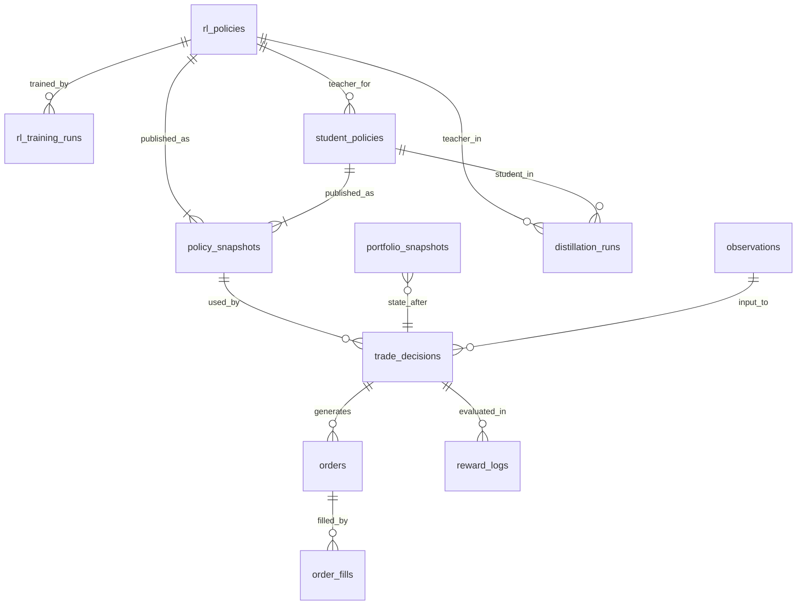
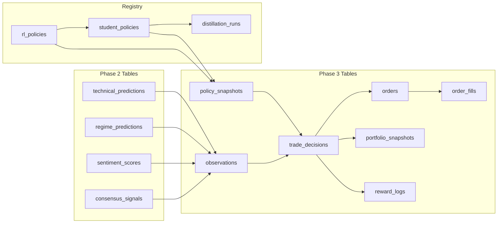

# Phase 3: Strategic Executive — Database Plan

**Alignment**: Multi-Agent Plan v1.3.7 §7 (Phase 3: Strategic Executive / Trader Ensemble)
**Prerequisite**: Phase 2 Analyst Board GO gate passed; Phase 1/2 tables in `src/db/models.py` are operational.
**Database**: PostgreSQL / TimescaleDB (same as Phase 1/2, via `src/db/connection.py`)

---

## 1. Overview

Phase 3 introduces the RL-based Trader Ensemble (SAC, PPO, TD3) that consumes Phase 2 signals and produces trade execution decisions. The database layer must support:

| Concern | Tables |
|---|---|
| **RL Policy Lifecycle** | `rl_policies`, `rl_training_runs` |
| **Observation & Decision** | `observations`, `trade_decisions` |
| **Order Execution** | `orders`, `order_fills` |
| **Portfolio State** | `portfolio_snapshots` |
| **Reward & Attribution** | `reward_logs` |
| **Student-Teacher Distillation** | `student_policies`, `distillation_runs` |
| **Deliberation & Slow Loop** | `policy_snapshots`, `deliberation_logs` |

---

## 2. Entity-Relationship Diagram

---

## 3. Table Definitions

### 3.1 `rl_policies` — RL Policy Registry

Tracks every trained RL policy (SAC, PPO, TD3) in the ensemble. Analogous to `model_cards` for Phase 2 models.

| Column | Type | Constraints | Description |
|---|---|---|---|
| `policy_id` | `String(128)` | **PK** | Unique ID, e.g. `sac_v1.2_20260401` |
| `algorithm` | `String(16)` | NOT NULL | `SAC`, `PPO`, `TD3` |
| `version` | `String(16)` | NOT NULL | Semantic version |
| `status` | `String(16)` | NOT NULL, default `candidate` | `candidate` → `shadow` → `champion` → `retired` |
| `created_at` | `DateTime(tz)` | NOT NULL | Training completion timestamp |
| `promoted_at` | `DateTime(tz)` | nullable | When promoted to `champion` |
| `retired_at` | `DateTime(tz)` | nullable | When retired |
| `artifact_path` | `Text` | NOT NULL | Path to serialized policy weights |
| `observation_schema_version` | `String(8)` | NOT NULL | Version of observation space used |
| `reward_function` | `String(32)` | NOT NULL | Reward variant used (e.g. `ra_drl_composite`) |
| `hyperparams_json` | `Text` | NOT NULL | Full hyperparameter config |
| `training_metrics_json` | `Text` | nullable | Final training metrics summary |
| `compression_method` | `String(32)` | nullable | `quantization`, `pruning`, `distillation`, `none` |
| `p99_inference_ms` | `Float` | nullable | Measured p99 inference latency |
| `p999_inference_ms` | `Float` | nullable | Measured p99.9 inference latency |
| `schema_version` | `String(8)` | NOT NULL, default `1.0` | |

> [!IMPORTANT]
> `status` transitions follow the promotion gate: candidate → shadow (paper trading) → champion (live). Rollback reverts champion → retired and promotes the previous champion.

---

### 3.2 `rl_training_runs` — Training Run History

One row per training run per policy. Supports reproducibility and audit.

| Column | Type | Constraints | Description |
|---|---|---|---|
| `id` | `Integer` | **PK**, auto | |
| `policy_id` | `String(128)` | **FK → rl_policies** | |
| `run_timestamp` | `DateTime(tz)` | NOT NULL | |
| `training_start` | `DateTime(tz)` | NOT NULL | Data window start |
| `training_end` | `DateTime(tz)` | NOT NULL | Data window end |
| `episodes` | `Integer` | NOT NULL | Total training episodes |
| `total_steps` | `BigInteger` | NOT NULL | Total environment steps |
| `final_reward` | `Float` | nullable | Final cumulative reward |
| `sharpe` | `Float` | nullable | |
| `sortino` | `Float` | nullable | |
| `max_drawdown` | `Float` | nullable | |
| `win_rate` | `Float` | nullable | |
| `dataset_snapshot_id` | `String(128)` | nullable | Traceability to data version |
| `code_hash` | `String(64)` | nullable | Git commit hash |
| `duration_seconds` | `Float` | nullable | Wall-clock training time |
| `notes` | `Text` | nullable | |

---

### 3.3 `observations` — Observation Space Snapshots

Versioned observation vectors consumed by RL policies. Contains Phase 2 outputs aggregated per decision tick.

| Column | Type | Constraints | Description |
|---|---|---|---|
| `id` | `BigInteger` | **PK**, auto | |
| `timestamp` | `DateTime(tz)` | NOT NULL | Observation time |
| `symbol` | `String(32)` | NOT NULL | |
| `snapshot_id` | `String(128)` | NOT NULL | Cross-loop snapshot reference |
| `technical_direction` | `String(8)` | NOT NULL | From `technical_predictions` |
| `technical_confidence` | `Float` | NOT NULL | |
| `price_forecast` | `Float` | NOT NULL | |
| `var_95` | `Float` | NOT NULL | |
| `es_95` | `Float` | NOT NULL | |
| `regime_state` | `String(32)` | NOT NULL | From `regime_predictions` |
| `regime_transition_prob` | `Float` | NOT NULL | |
| `sentiment_score` | `Float` | nullable | From `sentiment_scores` |
| `sentiment_z_t` | `Float` | nullable | |
| `consensus_direction` | `String(8)` | NOT NULL | From `consensus_signals` |
| `consensus_confidence` | `Float` | NOT NULL | |
| `crisis_mode` | `Boolean` | NOT NULL | |
| `agent_divergence` | `Boolean` | NOT NULL | |
| `orderbook_imbalance` | `Float` | nullable | Microstructure feature |
| `queue_pressure` | `Float` | nullable | Microstructure feature |
| `current_position` | `Float` | NOT NULL | Current portfolio position |
| `unrealized_pnl` | `Float` | NOT NULL | |
| `portfolio_features_json` | `Text` | nullable | Additional portfolio state |
| `observation_schema_version` | `String(8)` | NOT NULL, default `1.0` | |
| `quality_status` | `String(8)` | NOT NULL, default `pass` | |

**Index**: `(symbol, timestamp)` — for time-series queries.

> [!NOTE]
> This table materializes the observation space defined in §7.3 of the plan. It bridges Phase 2 outputs (technical, regime, sentiment, consensus) with Phase 3 RL input.

---

### 3.4 `trade_decisions` — Ensemble Output

One row per decision tick. Records what the ensemble decided and why.

| Column | Type | Constraints | Description |
|---|---|---|---|
| `id` | `BigInteger` | **PK**, auto | |
| `timestamp` | `DateTime(tz)` | NOT NULL | Decision time |
| `symbol` | `String(32)` | NOT NULL | |
| `observation_id` | `BigInteger` | **FK → observations** | Observation used |
| `policy_snapshot_id` | `String(128)` | **FK → policy_snapshots** | Active policy snapshot |
| `action` | `String(16)` | NOT NULL | `buy`, `sell`, `hold`, `close`, `reduce` |
| `action_size` | `Float` | NOT NULL | Target position size (units or notional) |
| `confidence` | `Float` | NOT NULL | Ensemble confidence |
| `entropy` | `Float` | nullable | Max-entropy framework output |
| `sac_weight` | `Float` | nullable | SAC contribution weight |
| `ppo_weight` | `Float` | nullable | PPO contribution weight |
| `td3_weight` | `Float` | nullable | TD3 contribution weight |
| `genetic_threshold` | `Float` | nullable | Multi-threshold GA output |
| `deliberation_used` | `Boolean` | NOT NULL, default `false` | Whether slow-loop deliberation influenced |
| `risk_override` | `String(16)` | nullable | `none`, `reduce_only`, `close_only`, `kill_switch` |
| `risk_override_reason` | `Text` | nullable | |
| `decision_latency_ms` | `Float` | NOT NULL | End-to-end decision time |
| `loop_type` | `String(8)` | NOT NULL | `fast` or `slow` |
| `schema_version` | `String(8)` | NOT NULL, default `1.0` | |

**Unique constraint**: `(symbol, timestamp, policy_snapshot_id)`

> [!IMPORTANT]
> `decision_latency_ms` is a key metric for the p99 ≤ 8ms Fast Loop target. Every decision is logged to support latency regression analysis and SLA enforcement.

---

### 3.5 `orders` — Order Lifecycle

Tracks order intent through execution. Supports audit trail per §3.

| Column | Type | Constraints | Description |
|---|---|---|---|
| `id` | `BigInteger` | **PK**, auto | |
| `order_id` | `String(128)` | UNIQUE, NOT NULL | Broker/internal order ID |
| `decision_id` | `BigInteger` | **FK → trade_decisions** | Originating decision |
| `symbol` | `String(32)` | NOT NULL | |
| `exchange` | `String(16)` | NOT NULL, default `NSE` | |
| `product_type` | `String(16)` | NOT NULL | `equity`, `futures`, `options`, `forex` |
| `order_type` | `String(16)` | NOT NULL | `market`, `limit`, `stop_loss`, `sl_market` |
| `side` | `String(4)` | NOT NULL | `buy`, `sell` |
| `quantity` | `Integer` | NOT NULL | Intended quantity |
| `price` | `Float` | nullable | Limit price (null for market orders) |
| `trigger_price` | `Float` | nullable | Stop-loss trigger |
| `status` | `String(16)` | NOT NULL | `pending` → `submitted` → `partial` → `filled` → `cancelled` → `rejected` |
| `submitted_at` | `DateTime(tz)` | nullable | Sent to broker |
| `filled_at` | `DateTime(tz)` | nullable | Fully filled |
| `cancelled_at` | `DateTime(tz)` | nullable | |
| `broker_order_id` | `String(128)` | nullable | Broker-assigned ID |
| `avg_fill_price` | `Float` | nullable | Weighted average fill price |
| `filled_quantity` | `Integer` | NOT NULL, default `0` | |
| `slippage_bps` | `Float` | nullable | Realized slippage vs model estimate |
| `model_version` | `String(128)` | NOT NULL | Policy version for audit trail |
| `compliance_check_passed` | `Boolean` | NOT NULL, default `true` | Pre-trade compliance gate |
| `rejection_reason` | `Text` | nullable | |
| `created_at` | `DateTime(tz)` | NOT NULL | |
| `updated_at` | `DateTime(tz)` | NOT NULL | |
| `schema_version` | `String(8)` | NOT NULL, default `1.0` | |

**Indexes**: `(symbol, created_at)`, `(status)`, `(decision_id)`

---

### 3.6 `order_fills` — Individual Fill Events

Partial/full fill events for a parent order.

| Column | Type | Constraints | Description |
|---|---|---|---|
| `id` | `BigInteger` | **PK**, auto | |
| `order_id` | `String(128)` | **FK → orders.order_id** | |
| `fill_timestamp` | `DateTime(tz)` | NOT NULL | |
| `fill_price` | `Float` | NOT NULL | |
| `fill_quantity` | `Integer` | NOT NULL | |
| `exchange_trade_id` | `String(128)` | nullable | Exchange-assigned trade ID |
| `fees` | `Float` | nullable | Brokerage + exchange fees |
| `impact_cost_bps` | `Float` | nullable | Estimated market impact |

---

### 3.7 `portfolio_snapshots` — Point-in-Time Book State

Captures net portfolio state after each decision tick. Supports PnL attribution and risk validation.

| Column | Type | Constraints | Description |
|---|---|---|---|
| `id` | `BigInteger` | **PK**, auto | |
| `timestamp` | `DateTime(tz)` | NOT NULL | Snapshot time |
| `symbol` | `String(32)` | NOT NULL | |
| `position_qty` | `Integer` | NOT NULL | Net position |
| `avg_entry_price` | `Float` | NOT NULL | |
| `market_price` | `Float` | NOT NULL | Current market price |
| `unrealized_pnl` | `Float` | NOT NULL | |
| `realized_pnl_session` | `Float` | NOT NULL | Session PnL |
| `realized_pnl_cumulative` | `Float` | NOT NULL | Lifetime PnL |
| `notional_exposure` | `Float` | NOT NULL | Gross notional |
| `net_exposure` | `Float` | NOT NULL | Net notional |
| `gross_exposure` | `Float` | NOT NULL | Gross across all positions |
| `sector` | `String(32)` | nullable | For concentration checks |
| `risk_budget_used_pct` | `Float` | nullable | Risk budget consumption |
| `operating_mode` | `String(16)` | NOT NULL, default `normal` | `normal`, `reduce_only`, `close_only`, `kill_switch` |
| `decision_id` | `BigInteger` | **FK → trade_decisions**, nullable | Decision that triggered snapshot |
| `schema_version` | `String(8)` | NOT NULL, default `1.0` | |

**Index**: `(symbol, timestamp)`

---

### 3.8 `reward_logs` — Reward Computation & Attribution

Records the reward computed for each decision, enabling reward function tuning and PnL attribution.

| Column | Type | Constraints | Description |
|---|---|---|---|
| `id` | `BigInteger` | **PK**, auto | |
| `decision_id` | `BigInteger` | **FK → trade_decisions** | |
| `timestamp` | `DateTime(tz)` | NOT NULL | |
| `symbol` | `String(32)` | NOT NULL | |
| `reward_function` | `String(32)` | NOT NULL | e.g. `ra_drl_composite`, `sharpe`, `sortino` |
| `total_reward` | `Float` | NOT NULL | |
| `return_component` | `Float` | nullable | Raw return portion |
| `risk_penalty` | `Float` | nullable | Downside penalty |
| `regime_weight` | `Float` | nullable | Regime-based dynamic weighting |
| `sentiment_weight` | `Float` | nullable | Sentiment-based weighting |
| `transaction_cost` | `Float` | nullable | Cost component |
| `components_json` | `Text` | nullable | Full breakdown of all reward terms |
| `regime_state` | `String(32)` | nullable | Active regime at reward time |

---

### 3.9 `policy_snapshots` — Published Policy State for Fast Loop

Atomic policy snapshots consumed by the Fast Loop. Maps to the cross-loop handoff protocol.

| Column | Type | Constraints | Description |
|---|---|---|---|
| `snapshot_id` | `String(128)` | **PK** | UUID for atomic swap |
| `policy_id` | `String(128)` | **FK → rl_policies** or **FK → student_policies** | Source policy |
| `policy_type` | `String(16)` | NOT NULL | `teacher` or `student` |
| `generated_at` | `DateTime(tz)` | NOT NULL | |
| `expires_at` | `DateTime(tz)` | NOT NULL | TTL for freshness |
| `is_active` | `Boolean` | NOT NULL, default `false` | Currently active in Fast Loop |
| `artifact_path` | `Text` | NOT NULL | Path to serialized snapshot |
| `quality_status` | `String(8)` | NOT NULL, default `pass` | `pass`, `warn`, `fail` |
| `source_type` | `String(32)` | NOT NULL | Provenance (e.g. `scheduled_refresh`, `emergency_swap`) |
| `schema_version` | `String(8)` | NOT NULL, default `1.0` | |

> [!NOTE]
> Maps to the cross-loop payload schema from `execution_loops.md`: `snapshot_id`, `generated_at`, `expires_at`, `schema_version`, `quality_status`, `source_type`.

---

### 3.10 `student_policies` — Distilled Student Policy Registry

Lightweight student models for Fast Loop execution (§7.2).

| Column | Type | Constraints | Description |
|---|---|---|---|
| `student_id` | `String(128)` | **PK** | e.g. `student_sac_v1.0_q8` |
| `teacher_policy_id` | `String(128)` | **FK → rl_policies** | Source teacher |
| `version` | `String(16)` | NOT NULL | |
| `status` | `String(16)` | NOT NULL, default `candidate` | `candidate` → `shadow` → `active` → `demoted` |
| `compression_method` | `String(32)` | NOT NULL | `quantization`, `pruning`, `distillation` |
| `compression_ratio` | `Float` | nullable | Size reduction factor |
| `teacher_agreement_pct` | `Float` | NOT NULL | Agreement on avg-day slices |
| `crisis_agreement_pct` | `Float` | NOT NULL | Agreement on crisis slices (§7.2 gate) |
| `p99_inference_ms` | `Float` | NOT NULL | Must meet Fast Loop budget |
| `p999_inference_ms` | `Float` | NOT NULL | |
| `artifact_path` | `Text` | NOT NULL | |
| `created_at` | `DateTime(tz)` | NOT NULL | |
| `promoted_at` | `DateTime(tz)` | nullable | |
| `demoted_at` | `DateTime(tz)` | nullable | |
| `drift_threshold` | `Float` | NOT NULL | Auto-demotion drift bound |
| `schema_version` | `String(8)` | NOT NULL, default `1.0` | |

> [!IMPORTANT]
> `crisis_agreement_pct` is a hard promotion gate — students that only match teacher decisions on average-day performance but fail on crisis slices MUST NOT be promoted (§7.2).

---

### 3.11 `distillation_runs` — Teacher→Student Training History

| Column | Type | Constraints | Description |
|---|---|---|---|
| `id` | `Integer` | **PK**, auto | |
| `student_id` | `String(128)` | **FK → student_policies** | |
| `teacher_policy_id` | `String(128)` | **FK → rl_policies** | |
| `run_timestamp` | `DateTime(tz)` | NOT NULL | |
| `epochs` | `Integer` | NOT NULL | |
| `avg_day_agreement` | `Float` | NOT NULL | |
| `crisis_slice_agreement` | `Float` | NOT NULL | |
| `kl_divergence` | `Float` | nullable | Student-teacher KL |
| `inference_latency_p99` | `Float` | NOT NULL | |
| `dataset_snapshot_id` | `String(128)` | nullable | |
| `code_hash` | `String(64)` | nullable | |
| `notes` | `Text` | nullable | |

---

### 3.12 `deliberation_logs` — Slow Loop Reasoning Trace

Records Slow Loop deliberation outputs that may influence the next Fast Loop decision refresh.

| Column | Type | Constraints | Description |
|---|---|---|---|
| `id` | `BigInteger` | **PK**, auto | |
| `timestamp` | `DateTime(tz)` | NOT NULL | |
| `symbol` | `String(32)` | NOT NULL | |
| `deliberation_type` | `String(32)` | NOT NULL | `policy_refresh`, `simulation`, `reward_reweight` |
| `input_snapshot_id` | `String(128)` | nullable | Snapshot used as input |
| `output_snapshot_id` | `String(128)` | nullable | New snapshot produced |
| `duration_ms` | `Float` | NOT NULL | |
| `result_json` | `Text` | nullable | Simulation or reasoning output |
| `triggered_refresh` | `Boolean` | NOT NULL, default `false` | Whether Fast Loop policy was refreshed |

---

## 4. Indexing & Partitioning Strategy

### Time-Series Partitioning (TimescaleDB Hypertables)

The following high-volume tables should be converted to TimescaleDB hypertables partitioned by `timestamp`:

| Table | Partition Interval | Retention |
|---|---|---|
| `observations` | 1 week | 12 months hot, archive after |
| `trade_decisions` | 1 week | Indefinite (audit) |
| `orders` | 1 month | Indefinite (audit/regulatory) |
| `order_fills` | 1 month | Indefinite (audit/regulatory) |
| `portfolio_snapshots` | 1 week | 6 months hot, archive after |
| `reward_logs` | 1 week | 12 months hot, archive after |
| `deliberation_logs` | 1 month | 6 months hot, archive after |

### Key Indexes

| Table | Index Columns | Purpose |
|---|---|---|
| `observations` | `(symbol, timestamp)` | Time-series lookups |
| `trade_decisions` | `(symbol, timestamp)` | Decision history queries |
| `trade_decisions` | `(decision_latency_ms)` | Latency SLA monitoring |
| `orders` | `(symbol, created_at)` | Order history |
| `orders` | `(status)` | Active order management |
| `portfolio_snapshots` | `(symbol, timestamp)` | Position history |
| `portfolio_snapshots` | `(operating_mode)` | Mode transition audit |
| `reward_logs` | `(symbol, timestamp)` | Reward analysis |
| `policy_snapshots` | `(is_active, policy_type)` | Fast Loop active policy lookup |

---

## 5. Data Flow Integration

### Write Paths

| Writer | Tables Written | Cadence |
|---|---|---|
| **Observation Assembler** (Slow Loop) | `observations` | Every decision tick (~1/hr or on event) |
| **Ensemble Decision Engine** (Fast Loop) | `trade_decisions` | Every decision tick |
| **Order Router** | `orders`, `order_fills` | Per order event |
| **Portfolio Tracker** | `portfolio_snapshots` | Post-decision + periodic |
| **Reward Computer** (Slow Loop) | `reward_logs` | Async after fill confirmation |
| **Training Pipeline** (Offline) | `rl_policies`, `rl_training_runs` | Per training run |
| **Distillation Pipeline** (Offline) | `student_policies`, `distillation_runs` | Per distillation run |
| **Policy Publisher** (Slow Loop) | `policy_snapshots` | On refresh (every ~10 min or on event) |
| **Deliberation Engine** (Slow Loop) | `deliberation_logs` | Per deliberation cycle |

---

## 6. Fast Loop Considerations

> [!WARNING]
> Per the execution loop architecture (`docs/architecture/execution_loops.md`), the Fast Loop **MUST NOT** perform database writes on the critical path. All writes listed above are either async, post-decision, or Slow Loop.

**Fast Loop reads** are restricted to:
- `policy_snapshots` — in-memory cache with O(1) lookup of active snapshot pointer
- **Not** direct DB queries — cache/atomic pointer swaps only

**Write buffering strategy**:
- `trade_decisions` rows are buffered in-memory and flushed asynchronously
- `orders` are written by the order router (off-critical-path)
- No DB writes block the p99 ≤ 8ms decision stack

---

## 7. Compliance & Audit Trail Mapping

Per §3 (Regulatory and Broker Compliance), the following audit requirements are satisfied:

| Audit Requirement | Covered By |
|---|---|
| Order intent | `trade_decisions.action`, `trade_decisions.confidence` |
| Execution | `orders.status`, `order_fills.*` |
| Cancellation | `orders.cancelled_at`, `orders.status = 'cancelled'` |
| Model version used | `orders.model_version`, `trade_decisions.policy_snapshot_id` |
| Pre-trade compliance | `orders.compliance_check_passed`, `orders.rejection_reason` |
| Risk overrides | `trade_decisions.risk_override`, `trade_decisions.risk_override_reason` |
| Decision latency | `trade_decisions.decision_latency_ms` |
| Slippage tracking | `orders.slippage_bps`, `order_fills.impact_cost_bps` |

---

## 8. Migration Plan

### Step 1: Add Models to `src/db/models.py`
Add all 12 new SQLAlchemy model classes to the existing `models.py` following the established patterns (same `Base`, same column conventions).

### Step 2: Create Phase 3 Recorder
Create `src/db/phase3_recorder.py` (analogous to `phase2_recorder.py`) with insert/upsert helpers for each new table.

### Step 3: Schema Migration
Run `alembic` (or manual `Base.metadata.create_all()` via `init_db.py`) to create the new tables in the existing database.

### Step 4: TimescaleDB Hypertable Conversion
Execute `create_hypertable()` for high-volume tables after initial creation.

### Step 5: Verification
- Confirm all 12 tables exist with correct schemas
- Insert sample rows and verify FK integrity
- Run existing Phase 1/2 tests to confirm no regressions

---

## 9. Schema Compatibility

All new tables follow existing conventions from `src/db/models.py`:
- `schema_version` column on every table
- `DateTime(timezone=True)` for all timestamps
- `String(32)` for symbol columns
- `quality_status` where applicable
- Same `Base = declarative_base()` inheritance
- Consistent `ingestion_timestamp_*` pattern where relevant

Per `docs/governance/schema_compatibility_rules.md`, all changes are additive (new tables only) — no existing table modifications required.
