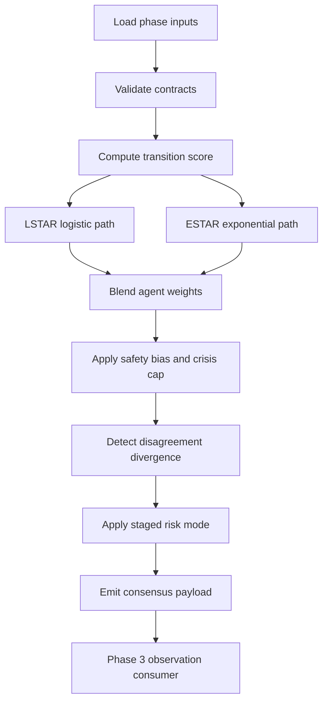

# Week 8 Plan: Consensus Agent (Phase 2)

**Week window**: Monday, March 23, 2026 to Sunday, March 29, 2026  
**Alignment**: Multi-Agent Plan v1.3.7 §6.4 (Consensus Agent)  
**Goal**: Start implementation of the Consensus Agent that combines Technical, Regime, and Sentiment outputs into a single downstream-ready signal.

---

## Scope for Week 8

- Implement a production-style package at `src/agents/consensus/`.
- Define strict input/output schemas for agent-level signals and consensus output payload.
- Implement initial transition/routing logic:
  - LSTAR and ESTAR transition scores
  - Weighted aggregation with safety bias toward protective signals
  - Crisis weighting cap (`max_crisis_weight`)
  - Divergence detection and staged risk downgrade
- Add starter tests to validate deterministic behavior and guardrail enforcement.

---

## Implementation Workflow

---

## Day-by-Day (Starter Execution)

### Day 1
- Create `consensus` package skeleton.
- Add schema models for upstream inputs and consensus output.
- Implement baseline consensus orchestrator with deterministic output.

### Day 2
- Add transition functions (LSTAR + ESTAR).
- Add crisis-weighted routing with dominance cap.
- Add divergence detection and risk-mode downgrade.

### Day 3
- Integrate with Phase 2 output adapters.
- Add tests for transition ranges, crisis cap, and divergence behavior.
- Freeze initial output schema for Phase 3 handoff.

---

## Exit Criteria (Week 8 Starter)

- Consensus package exists with runnable `ConsensusAgent` API.
- Output schema is versioned and validated.
- Workflow path is documented and test-backed.
- Initial tests pass for:
  - transition function bounds,
  - crisis cap enforcement,
  - divergence-triggered risk downgrade.
