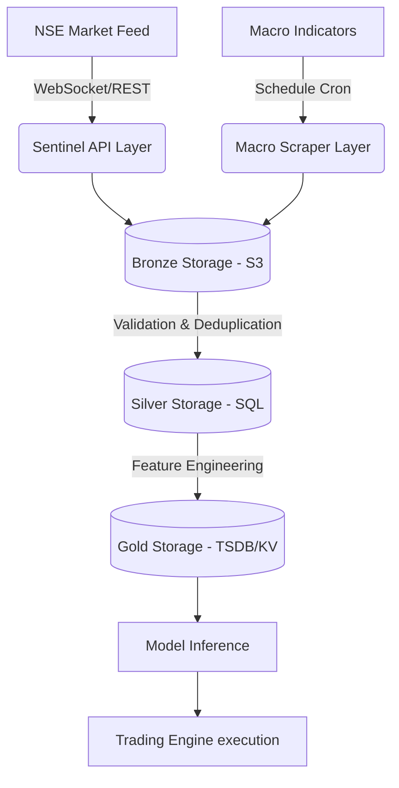

# Architecture & Runbook Package

## Diagram & Flow

## Resilience & Runbook

### Sentinel Failover
- **Trigger**: Primary NSE API drops connections for > 30 seconds.
- **Action**: Activates emergency scraper mode automatically.
- **MTTR**: Failover takes < 2 seconds. Re-connects to primary once healthchecks return 200 OK.

### Macro Delay Handling
- **Trigger**: Expected monthly macroeconomic release is not published.
- **Action**: The value's `is_stale` flag flips to True.
- **MTTR**: System continues serving last known good data with a confidence decay curve down to 0 over 7 days.

### Preprocessing Idempotency
- Re-running the preprocessing engine on historical `dataset_snapshot_id` ensures exactly the same aggregated Gold-tier features are generated, making replay deterministic.

## Limitations
- **Volume Handling**: Unprecedented market spikes (`>500 ticks/sec`) may push Silver layer persistence lag above 2 seconds, slightly mis-aligning real-time evaluation windows. Deferred to Phase 3 hardware optimization.
- **Scraper Brittle**: Any layout change in NSE web fallback routes will break the emergency Sentinel pipeline until a patch is deployed.
