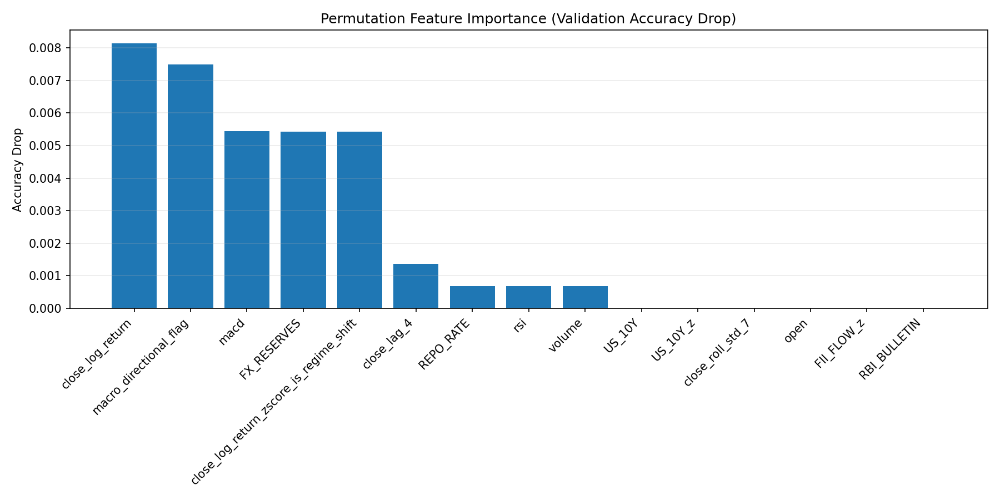
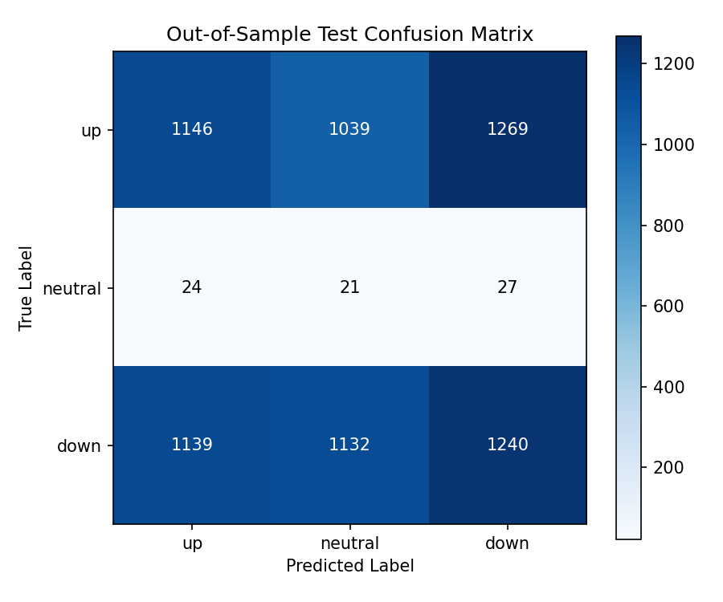
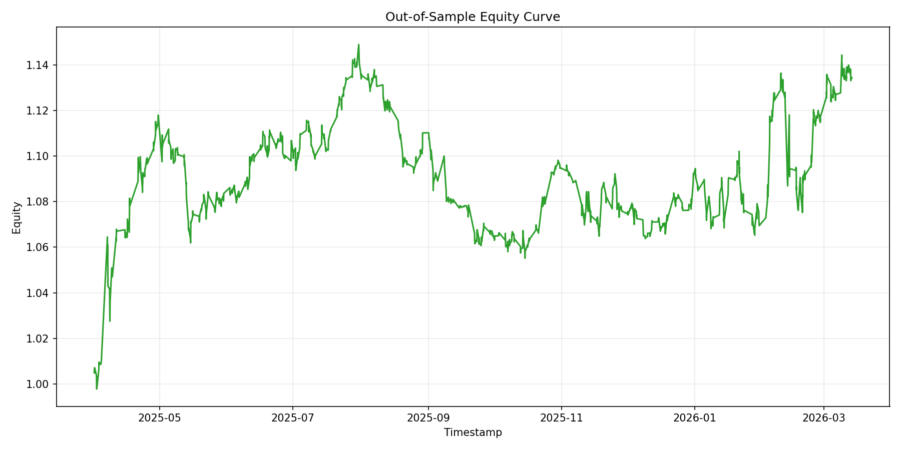
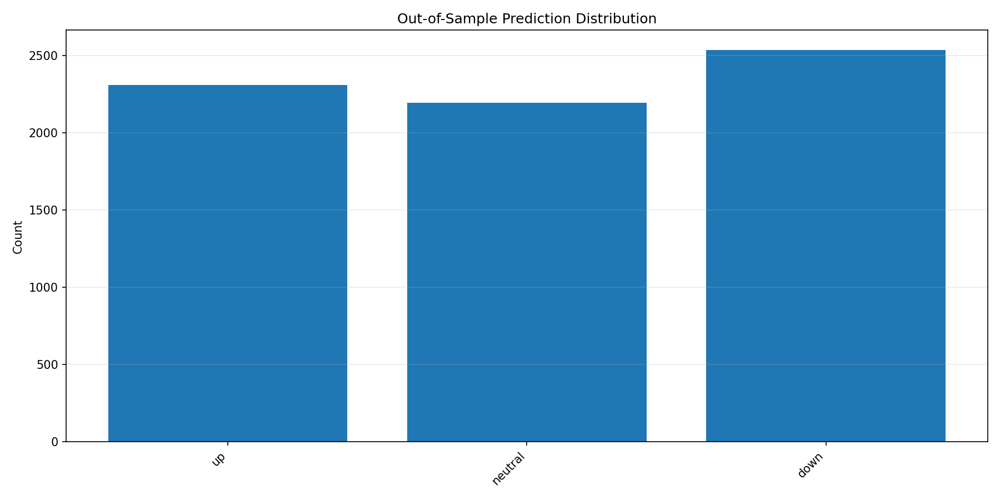

# Model Training Report 20260316_120734

## Dataset Summary

- Total NSE equity symbols available: `4`
- Train-ready symbols: `4`
- Symbols excluded by quality gates: `none`
- Total clean rows: `7343`
- Total feature rows: `7343`
- Rows dropped during initial OHLC cleanup: `0`
- Rows with missing selected features before imputation: `6621`
- Final training window: `2025-03-17T03:45:00+00:00` -> `2026-01-22T03:45:00+00:00`
- Validation window: `2026-01-21T04:45:00+00:00` -> `2026-03-16T09:45:57.938863+00:00`
- Test window: `2025-04-01T03:45:00+00:00` -> `2026-03-13T18:55:58.544957+00:00`

| Symbol | Source | Raw Rows | Clean Rows | Feature Rows | Dropped Clean | Missing Features Pre-Impute | CNN Train Windows | CNN Val Windows |
| --- | --- | --- | --- | --- | --- | --- | --- | --- |
| INFY.NS | ohlcv_bars | 1835 | 1835 | 1835 | 0 | 1597 | 1438 | 367 |
| RELIANCE.NS | gold_features | 1842 | 1842 | 1842 | 0 | 1834 | 1443 | 369 |
| TATASTEEL.NS | ohlcv_bars | 1833 | 1833 | 1833 | 0 | 1595 | 1436 | 367 |
| TCS.NS | ohlcv_bars | 1833 | 1833 | 1833 | 0 | 1595 | 1436 | 367 |

## Feature Coverage

| Feature | Coverage % |
| --- | --- |
| DII_FLOW | 4.2888 |
| DII_FLOW_z | 4.2888 |
| FII_FLOW | 4.2888 |
| FII_FLOW_z | 4.2888 |
| FX_RESERVES | 0.4343 |
| INDIA_US_10Y_SPREAD | 4.2888 |
| INDIA_US_10Y_SPREAD_z | 10.7492 |
| RBI_BULLETIN | 4.2345 |
| REPO_RATE | 100.0 |
| REPO_RATE_z | 16.6008 |
| US_10Y | 100.0 |
| US_10Y_z | 99.3872 |
| close | 100.0 |
| close_lag_1 | 99.9455 |
| close_lag_2 | 99.8911 |
| close_lag_3 | 99.8366 |
| close_lag_4 | 99.7821 |
| close_lag_5 | 99.7276 |
| close_log_return | 100.0 |
| close_log_return_zscore | 100.0 |
| close_log_return_zscore_is_anomaly | 100.0 |
| close_log_return_zscore_is_regime_shift | 100.0 |
| close_roll_mean_14 | 99.2918 |
| close_roll_mean_7 | 99.6732 |
| close_roll_std_14 | 99.2918 |
| close_roll_std_7 | 99.6732 |
| high | 100.0 |
| low | 100.0 |
| macd | 100.0 |
| macd_hist | 100.0 |
| macd_signal | 100.0 |
| macro_coverage_ratio | 100.0 |
| macro_directional_flag | 100.0 |
| macro_regime_index | 100.0 |
| macro_regime_shock | 100.0 |
| open | 100.0 |
| rsi | 99.2374 |
| volume | 100.0 |

## Training Configuration

```json
{
  "symbols": [
    "INFY.NS",
    "RELIANCE.NS",
    "TATASTEEL.NS",
    "TCS.NS"
  ],
  "interval": "1h",
  "limit": 4000,
  "train_split": 0.8,
  "epochs": 150,
  "batch_size": 32,
  "patience": 25,
  "scheduler_patience": 10,
  "lr": 0.001,
  "weight_decay": 0.0001,
  "dropout": 0.25,
  "reg_window": 20,
  "cnn_window": 30,
  "neutral_threshold": 0.0045,
  "arima_order": "5,1,0",
  "lstm_hidden_size": 64,
  "lstm_layers": 2,
  "seed": 42,
  "device": "cpu",
  "run_root": "/Users/juhi/Desktop/algo-trading/data/reports/training_runs/regime_aware_1h_20260316_120000"
}
```

## Validation Metrics

- Training accuracy: `0.3494`
- Validation accuracy: `0.4898`
- Precision (weighted): `0.6415`
- Recall (weighted): `0.4898`
- F1 (weighted): `0.5456`
- Overfitting gap (train - validation): `-0.1404`

|  | up | neutral | down |
| --- | --- | --- | --- |
| up | 39 | 76 | 31 |
| neutral | 303 | 637 | 204 |
| down | 39 | 97 | 44 |

## Test Metrics

- Test accuracy: `0.3420`
- Precision (weighted): `0.4877`
- Recall (weighted): `0.3420`
- F1 (weighted): `0.4000`

|  | up | neutral | down |
| --- | --- | --- | --- |
| up | 1146 | 1039 | 1269 |
| neutral | 24 | 21 | 27 |
| down | 1139 | 1132 | 1240 |

## Trading Performance

- Sharpe ratio: `0.588989`
- Max drawdown: `-0.29391`
- Win rate: `0.339065`
- Profit factor: `1.06745`
- Average trade return: `0.000107`
- Total trades simulated: `4845`

## Diagnostics

- Validation prediction distribution: `{'up': 381, 'neutral': 810, 'down': 279}`
- Validation class balance: `{'up': 146, 'neutral': 1144, 'down': 180}`
- Test prediction distribution: `{'up': 2309, 'neutral': 2192, 'down': 2536}`
- Test class balance: `{'up': 3454, 'neutral': 72, 'down': 3511}`

## Feature Importance

| Feature | Validation Accuracy Drop |
| --- | --- |
| close_log_return | 0.00813 |
| macro_directional_flag | 0.007483 |
| macd | 0.005442 |
| FX_RESERVES | 0.00542 |
| close_log_return_zscore_is_regime_shift | 0.00542 |
| close_lag_4 | 0.001361 |
| REPO_RATE | 0.00068 |
| rsi | 0.00068 |
| volume | 0.00068 |
| US_10Y | -0.0 |
| US_10Y_z | -0.0 |
| close_roll_std_7 | -0.0 |
| open | -0.0 |
| FII_FLOW_z | 0.0 |
| RBI_BULLETIN | 0.0 |

## Previous Run Comparison

- No direct prior run with overlapping symbol coverage was found in stored metrics.

## Charts









## Conclusions

- The dataset now supports `4` train-ready NSE equity symbols at `1h`.
- Validation accuracy is `0.4898` and out-of-sample test accuracy is `0.3420`.
- Trading Sharpe is `0.588989` with max drawdown `-0.29391`.
- The largest validation feature-importance drivers are `close_log_return, macro_directional_flag, macd, FX_RESERVES, close_log_return_zscore_is_regime_shift`.
